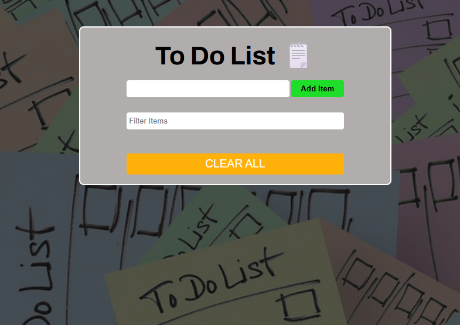

# To-Do App

A simple and interactive To Do List application built with vanilla JavaScript.  
Users can add tasks, filter them in real time, remove individual items, or clear the entire list.

## Demo

[Live Demo](https://allencodess.github.io/todo-app-js/)

## Features

- Add new tasks to the list
- Delete individual tasks
- Clear all tasks at once
- Filter tasks by typing keywords

## Built With

- HTML5
- CSS3
- JavaScript (Vanilla)

## How to Use

1. Type a task into the input field
2. Click **Add Item** to add it to the list
3. Use the **Filter Items** input to search tasks
4. Click the red minus icon to remove a task
5. Click **CLEAR ALL** to remove all tasks
